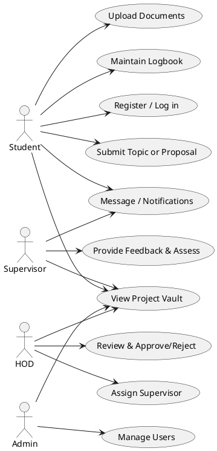
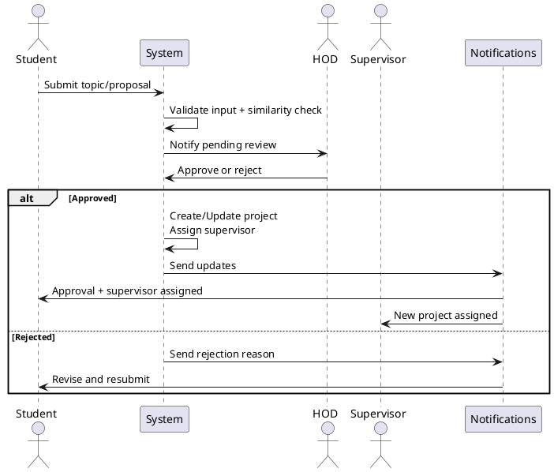
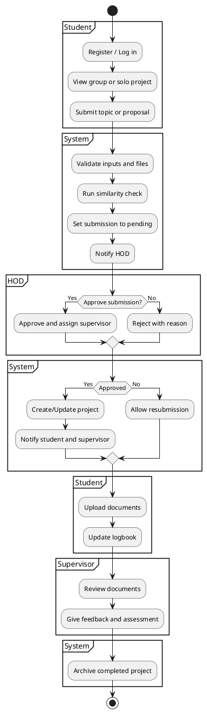

# Project Diagrams (Simple Overview)

These diagrams give a simple, supervisor-friendly view of how the Final Year Project Vault works.

## Use Case Diagram (PlantUML)

## Sequence Diagram (PlantUML)

## Flowcharts by Role (PlantUML)

### Student Flowchart

```plantuml
@startuml
start
:Enter email and password; <<input>>
while (Credentials valid?) is (No)
  :Show error message;
  :Enter email and password; <<input>>
endwhile (Yes)
:Open student dashboard;
if (In a group?) then (Yes)
  :View group status;
endif
:Submit topic or proposal;
while (Approved?) is (No)
  :Revise and resubmit;
endwhile (Yes)
:Upload documents;
:Update logbook;
:Message supervisor;
:Browse Project Vault;
stop
@enduml
```

### Supervisor Flowchart

```plantuml
@startuml
start
:Enter email and password; <<input>>
while (Credentials valid?) is (No)
  :Show error message;
  :Enter email and password; <<input>>
endwhile (Yes)
:Open supervisor dashboard;
:View assigned group vaults;
:Open a project;
:Review documents;
:Provide feedback;
:Submit assessment;
:Reply to messages;
:Browse Project Vault;
stop
@enduml
```

### HOD Flowchart

```plantuml
@startuml
start
:Enter email and password; <<input>>
while (Credentials valid?) is (No)
  :Show error message;
  :Enter email and password; <<input>>
endwhile (Yes)
:Open HOD dashboard;
:Import/form student groups;
repeat
  :Review submitted topics/proposals;
  if (Approve?) then (Yes)
    :Assign supervisor;
  else (No)
    :Reject with reason;
  endif
repeat while (More submissions?) is (Yes)
:Generate reports;
:Browse Project Vault;
stop
@enduml
```

### Admin Flowchart

```plantuml
@startuml
start
:Enter email and password; <<input>>
while (Credentials valid?) is (No)
  :Show error message;
  :Enter email and password; <<input>>
endwhile (Yes)
:Open admin dashboard;
:Create/Edit/Archive users;
:Manage system data;
:View audit logs;
:Browse Project Vault;
stop
@enduml
```

## Database Schema (PlantUML, Simplified)

```plantuml
@startuml
left to right direction
skinparam linetype ortho
hide circle

package "Core Users & Projects" {
  entity "users" as USERS {
    *id : int
    --
    role
    department
  }

  entity "projects" as PROJECTS {
    *id : int
    --
    student_id
    supervisor_id
    approved_by
    group_id
    status
  }

  entity "groups" as GROUPS {
    *id : int
    --
    created_by
    supervisor_id
    status
  }

  entity "group_members" as GROUP_MEMBERS {
    *id : int
    --
    group_id
    student_id
  }

  entity "group_submissions" as GROUP_SUBMISSIONS {
    *id : int
    --
    group_id
    submitted_by
    reviewed_by
    status
  }

  entity "archive_metadata" as ARCHIVE_METADATA {
    *id : int
    --
    project_id
    archived_by
  }
}

package "Project Work" {
  entity "project_documents" as PROJECT_DOCUMENTS {
    *id : int
    --
    project_id
    uploader_id
  }

  entity "document_feedback" as DOCUMENT_FEEDBACK {
    *id : int
    --
    document_id
    supervisor_id
  }

  entity "assessments" as ASSESSMENTS {
    *id : int
    --
    project_id
    supervisor_id
  }

  entity "logbook_entries" as LOGBOOK_ENTRIES {
    *id : int
    --
    project_id
    created_by
    approved_by
  }

  entity "project_milestones" as PROJECT_MILESTONES {
    *id : int
    --
    project_id
    created_by
    completed_by
  }

  entity "project_contribution_status" as PROJECT_CONTRIBUTION_STATUS {
    *id : int
    --
    project_id
    student_id
    updated_by
  }

  entity "supervisor_logsheets" as SUPERVISOR_LOGSHEETS {
    *id : int
    --
    project_id
    supervisor_id
  }
}

package "Communication" {
  entity "messages" as MESSAGES {
    *id : int
    --
    project_id
    sender_id
    recipient_id
  }

  entity "notifications" as NOTIFICATIONS {
    *id : int
    --
    user_id
  }
}

package "Vault Discovery" {
  entity "project_tags" as PROJECT_TAGS {
    *id : int
  }

  entity "project_tag_map" as PROJECT_TAG_MAP {
    *project_id : int
    *tag_id : int
  }

  entity "project_views" as PROJECT_VIEWS {
    *id : int
    --
    project_id
    user_id
  }

  entity "project_ratings" as PROJECT_RATINGS {
    *id : int
    --
    project_id
    user_id
  }

  entity "user_interests" as USER_INTERESTS {
    *id : int
    --
    user_id
  }
}

package "Announcements & Meetings" {
  entity "announcements" as ANNOUNCEMENTS {
    *id : int
    --
    author_id
  }

  entity "announcement_reads" as ANNOUNCEMENT_READS {
    *id : int
    --
    announcement_id
    user_id
  }

  entity "meetings" as MEETINGS {
    *id : int
    --
    project_id
    requester_id
    supervisor_id
  }
}

package "Viva" {
  entity "viva_details" as VIVA_DETAILS {
    *id : int
    --
    project_id
  }

  entity "viva_materials" as VIVA_MATERIALS {
    *id : int
    --
    project_id
    student_id
  }

  entity "viva_recordings" as VIVA_RECORDINGS {
    *id : int
    --
    project_id
    student_id
  }

  entity "viva_checklist" as VIVA_CHECKLIST {
    *id : int
    --
    project_id
    student_id
  }

  entity "viva_feedback" as VIVA_FEEDBACK {
    *id : int
    --
    project_id
    supervisor_id
  }
}

package "Auth & Ops" {
  entity "otp_verifications" as OTP_VERIFICATIONS {
    *email : varchar
  }

  entity "password_resets" as PASSWORD_RESETS {
    *id : int
    --
    email
  }

  entity "audit_logs" as AUDIT_LOGS {
    *id : int
    --
    user_id
  }

  entity "bulk_import_logs" as BULK_IMPORT_LOGS {
    *id : int
    --
    imported_by
  }
}

USERS ||--o{ PROJECTS : student_id
USERS ||--o{ PROJECTS : supervisor_id
USERS ||--o{ PROJECTS : approved_by
GROUPS ||--o| PROJECTS : group_id

USERS ||--o{ GROUPS : created_by
USERS ||--o{ GROUPS : supervisor_id
GROUPS ||--o{ GROUP_MEMBERS : group_id
USERS ||--o{ GROUP_MEMBERS : student_id
GROUPS ||--o{ GROUP_SUBMISSIONS : group_id
USERS ||--o{ GROUP_SUBMISSIONS : submitted_by/reviewed_by

PROJECTS ||--o{ PROJECT_DOCUMENTS : project_id
USERS ||--o{ PROJECT_DOCUMENTS : uploader_id
PROJECT_DOCUMENTS ||--o{ DOCUMENT_FEEDBACK : document_id
USERS ||--o{ DOCUMENT_FEEDBACK : supervisor_id
PROJECTS ||--o{ ASSESSMENTS : project_id
USERS ||--o{ ASSESSMENTS : supervisor_id
PROJECTS ||--o{ LOGBOOK_ENTRIES : project_id
USERS ||--o{ LOGBOOK_ENTRIES : created_by/approved_by
PROJECTS ||--o{ PROJECT_MILESTONES : project_id
USERS ||--o{ PROJECT_MILESTONES : created_by/completed_by
PROJECTS ||--o{ PROJECT_CONTRIBUTION_STATUS : project_id
USERS ||--o{ PROJECT_CONTRIBUTION_STATUS : student_id/updated_by
PROJECTS ||--o{ SUPERVISOR_LOGSHEETS : project_id
USERS ||--o{ SUPERVISOR_LOGSHEETS : supervisor_id

PROJECTS ||--o{ MESSAGES : project_id
USERS ||--o{ MESSAGES : sender_id/recipient_id
USERS ||--o{ NOTIFICATIONS : user_id

PROJECTS ||--o| ARCHIVE_METADATA : project_id
USERS ||--o{ ARCHIVE_METADATA : archived_by

PROJECTS ||--o{ PROJECT_TAG_MAP : project_id
PROJECT_TAGS ||--o{ PROJECT_TAG_MAP : tag_id
PROJECTS ||--o{ PROJECT_VIEWS : project_id
USERS ||--o{ PROJECT_VIEWS : user_id
PROJECTS ||--o{ PROJECT_RATINGS : project_id
USERS ||--o{ PROJECT_RATINGS : user_id
USERS ||--o{ USER_INTERESTS : user_id

USERS ||--o{ ANNOUNCEMENTS : author_id
ANNOUNCEMENTS ||--o{ ANNOUNCEMENT_READS : announcement_id
USERS ||--o{ ANNOUNCEMENT_READS : user_id
PROJECTS ||--o{ MEETINGS : project_id
USERS ||--o{ MEETINGS : requester_id/supervisor_id

PROJECTS ||--o| VIVA_DETAILS : project_id
PROJECTS ||--o{ VIVA_MATERIALS : project_id
PROJECTS ||--o{ VIVA_RECORDINGS : project_id
PROJECTS ||--o{ VIVA_CHECKLIST : project_id
PROJECTS ||--o{ VIVA_FEEDBACK : project_id
USERS ||--o{ VIVA_MATERIALS : student_id
USERS ||--o{ VIVA_RECORDINGS : student_id
USERS ||--o{ VIVA_CHECKLIST : student_id
USERS ||--o{ VIVA_FEEDBACK : supervisor_id

USERS ||--o{ AUDIT_LOGS : user_id
USERS ||--o{ BULK_IMPORT_LOGS : imported_by
@enduml
```

## Activity Diagram (PlantUML)

